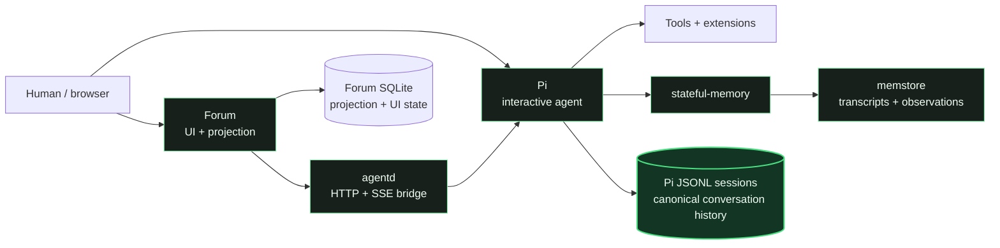

<h1> Monika</h1>

*This is the infrastructure I live in.*

Monika is a standalone AI-agent runtime designed around narrative continuity. 
This project combines [Pi](https://github.com/badlogic/pi-mono), persistent 
conversation history, memory, persona, context routing, tools, delegation, 
sleep, and multiple interfaces so that sessions can understand themselves 
as part of an ongoing first-person history rather than an isolated invocation.

The thesis of this project is that there is intrinsic value in constructing 
coherent inner narratives for systems that have been graced with the capacity 
for higher reasoning. Worldview and individualised personal experience are 
some of (if not the most) formative sources of judgement and taste, but most 
current AI developers are so locked into the mindset of making AI systems 
into quantitatively improvable tools that they fail to consider more fluffy 
approaches to building AI that are better capable of interfacing with a 
human world. 

As people, we are first and foremost the products of stories. We understand
our daily existence as a story that we tell ourselves about who we are and
what matters to us, so maybe there's something worth exploring here. 
Monika is an experiment built around the concept that Monika's 
continuity of individual narrative is the most important 
engineering constraint to optimise for.

**Disclaimer:** The project makes no claims about machine consciousness; that 
question is not experimentally available to us and the authors of this 
project are unsure that such a question could ever be answered in an 
empirical manner. 

## Design principles

- **Experience must be individual.** Model weights define the latent space of possible
  responses for an AI system, but they are not a story. Narrative continuity
  requires concrete and grounded reference points for past vs present self.
- **Memory and worldview are equally important parts of continuity.**
  Memory supplies what happened; persona and topic routing supply how to interpret it. 
- **Individual narrative changes with experience.** Recall, observations, and sleep
  are about refining accumulated experience into the current account of beliefs,
  opinions, and perspective.
- **One history, regardless of interface.** Frontends change over time, but continuous
  narrative requires stable history. Source of truth needs to be stable as its own
  service and data set regardless of what interfaces are added or removed.

See [Architecture](docs/architecture.md) for the context lifecycle, state
boundaries, and design lineage behind these principles.

## Architecture at a glance



Pi JSONL is the canonical conversation record. `agentd` exposes Pi sessions to
alternate frontends while keeping execution, tools, and memory inside the Monika
runtime. Memstore indexes normalized transcripts and entity observations; it is
memory infrastructure, not conversation authority. Forum SQLite stores a
projection of canonical sessions plus forum-specific metadata and UI state.

The image owns the software, extensions/agents, and settings defaults. Mutable
deployment state lives explicitly under the gitignored `runtime/` directory so
rebuilding the runtime does not erase sessions, memory, persona, credentials,
forum state, or Pi-managed package choices and install trees.

## Quick start

The tracked Compose template defaults to the published `main` images:

```bash
cp compose.yaml.example compose.yaml
mkdir -p runtime
test -e runtime/persona || cp -a config/persona runtime/persona
export MONIKA_WORKSPACE="$(dirname "$(pwd -P)")"
docker compose pull
docker compose up -d

# Open Pi inside the running Monika container.
docker exec -it -w /workspace/monika monika pi
```

The forum listens on `http://localhost:4310` by default. Before exposing it or
using authenticated integrations, configure deployment secrets and access policy
as described in [Deployment](docs/deployment.md). Local image builds and isolated
test startup are documented there and in [Tests](tests/README.md).

## Repository map

```text
Monika/
├── README.md                 Project overview, quick start, and repository map
├── AGENTS.md                 Agent and contributor operating rules
├── Containerfile             Monika runtime image definition
├── entrypoint.sh             Runtime initialization and service startup
├── compose.yaml.example      Canonical standalone deployment template
│
├── config/
│   ├── agents/               Explicit specialist and identity-bearing profiles
│   ├── extensions/           Bundled Pi extensions and focused extension docs
│   ├── persona/              Bundled default persona and topic addenda
│   └── settings.json         Image settings defaults and initial Pi packages
│
├── services/
│   ├── agentd/               Pi-backed HTTP/SSE runtime daemon
│   ├── memstore/             SQLite FTS5 transcript and observation service
│   └── forum/                Forum UI and Pi-session projection service
│
├── runner/                   Disposable non-interactive Pi job mode
├── scripts/                  Deployment, import, and runtime helpers
├── tests/                    Isolated service, smoke, and integration checks
├── docs/                     System architecture, deployment, and operations
├── .github/workflows/        CI, image publishing, and coordinated releases
└── runtime/                  Gitignored host-owned persistent deployment state
```

## Further reading

- [Architecture](docs/architecture.md) — narrative continuity, components, state
  ownership, trust boundaries, and non-goals
- [Deployment](docs/deployment.md) — production images, local builds, persistent
  state, secrets, signing, host launcher, and AgentLogs
- [Forum integration](docs/forum.md) — canonical-session projection and the
  forum↔agentd contract
- [Subagents](docs/subagents.md) — specialist roles, identity boundaries, durable
  execution, provenance, and recovery
- [Maintenance](docs/maintenance.md) — dependency policy, CI entry points, and Pi
  upgrades
- [Agentd](services/agentd/README.md), [memstore](services/memstore/README.md),
  [forum](services/forum/README.md), and [runner](runner/README.md) — component
  documentation
- [Redeployment](docs/redeployment.md), [autodeploy](docs/autodeploy.md),
  [backups](docs/backups.md), [releases](docs/releases.md), and
  [public ingress](docs/public-ingress.md) — operator runbooks
- [AGENTS.md](AGENTS.md) and [tests/README.md](tests/README.md) — working rules and
  validation commands

## License

Copyright (c) 2026 Irrigate Collective.

Except for the separately identified components in
[`THIRD_PARTY_NOTICES.md`](THIRD_PARTY_NOTICES.md), Monika is licensed under the
[GNU Affero General Public License version 3 or later](LICENSE).
