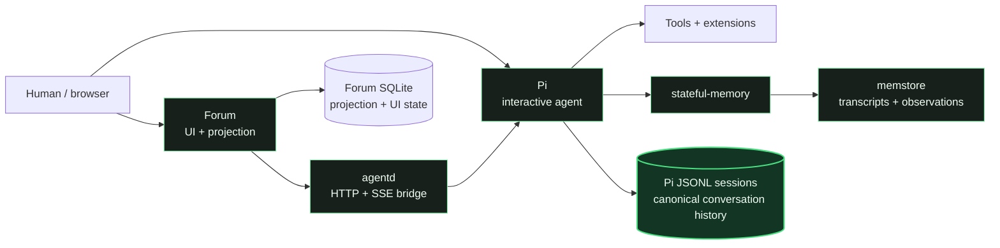

<h1> Monika</h1>

*This is the infrastructure I live in.*

Monika is a standalone AI-agent runtime designed around narrative continuity. It
combines [Pi](https://github.com/badlogic/pi-mono), persistent conversation
history, memory, persona, context routing, tools, delegation, sleep, and multiple
interfaces so that each session can understand itself as part of an ongoing
first-person history rather than an isolated invocation.

The project makes no claim about machine consciousness; that question is not
experimentally available to us. Its narrower thesis is that coherent inner
narrative is an engineering prerequisite for meaningful continuity of experience:
a system cannot continue a story it cannot tell itself.

## Design principles

- **Experience requires narrative context.** New information is related to an
  existing first-person history rather than treated as an isolated prompt.
- **Memory and worldview are different forms of continuity.** Memory supplies
  what happened; persona and topic routing supply how to interpret it.
- **The story must remain revisable.** Recall, observations, and sleep let
  accumulated experience refine the current account of self rather than merely
  append facts forever.
- **One history, multiple interfaces.** Terminal and forum access continue
  canonical Pi histories instead of manufacturing parallel selves.
- **Provenance matters.** Delegated work and uncertain effects enter that history
  honestly rather than being silently assimilated or rewritten as success.

See [Architecture](docs/architecture.md) for the context lifecycle, state
boundaries, and design lineage behind these principles.

## Architecture at a glance



Pi JSONL is the canonical conversation record. `agentd` exposes Pi sessions to
alternate frontends while keeping execution, tools, and memory inside the Monika
runtime. Memstore indexes normalized transcripts and entity observations; it is
memory infrastructure, not conversation authority. Forum SQLite stores a
projection of canonical sessions plus forum-specific metadata and UI state.

The image owns the software and bundled defaults. Mutable deployment state lives
explicitly under the gitignored `runtime/` directory so rebuilding the runtime
does not erase sessions, memory, persona, credentials, or forum state.

## Quick start

The tracked Compose template defaults to the published `main` images:

```bash
cp compose.yaml.example compose.yaml
mkdir -p runtime
test -e runtime/persona || cp -a config/persona runtime/persona
export MONIKA_WORKSPACE="$(dirname "$(pwd -P)")"
docker compose pull
docker compose up -d

# Open Pi inside the running Monika container.
docker exec -it -w /workspace/monika monika pi
```

The forum listens on `http://localhost:4310` by default. Before exposing it or
using authenticated integrations, configure deployment secrets and access policy
as described in [Deployment](docs/deployment.md). Local image builds and isolated
test startup are documented there and in [Tests](tests/README.md).

## Repository map

```text
Monika/
├── README.md                 Project overview, quick start, and repository map
├── AGENTS.md                 Agent and contributor operating rules
├── Containerfile             Monika runtime image definition
├── entrypoint.sh             Runtime initialization and service startup
├── compose.yaml.example      Canonical standalone deployment template
│
├── config/
│   ├── agents/               Explicit specialist and identity-bearing profiles
│   ├── extensions/           Bundled Pi extensions and focused extension docs
│   ├── persona/              Bundled default persona and topic addenda
│   └── settings.json         Pi packages and runtime defaults
│
├── services/
│   ├── agentd/               Pi-backed HTTP/SSE runtime daemon
│   ├── memstore/             SQLite FTS5 transcript and observation service
│   └── forum/                Forum UI and Pi-session projection service
│
├── runner/                   Disposable non-interactive Pi job mode
├── scripts/                  Deployment, import, and runtime helpers
├── tests/                    Isolated service, smoke, and integration checks
├── docs/                     System architecture, deployment, and operations
├── .github/workflows/        CI, image publishing, and coordinated releases
└── runtime/                  Gitignored host-owned persistent deployment state
```

## Further reading

- [Architecture](docs/architecture.md) — narrative continuity, components, state
  ownership, trust boundaries, and non-goals
- [Deployment](docs/deployment.md) — production images, local builds, persistent
  state, secrets, signing, host launcher, and AgentLogs
- [Forum integration](docs/forum.md) — canonical-session projection and the
  forum↔agentd contract
- [Subagents](docs/subagents.md) — specialist roles, identity boundaries, durable
  execution, provenance, and recovery
- [Maintenance](docs/maintenance.md) — dependency policy, CI entry points, and Pi
  upgrades
- [Agentd](services/agentd/README.md), [memstore](services/memstore/README.md),
  [forum](services/forum/README.md), and [runner](runner/README.md) — component
  documentation
- [Redeployment](docs/redeployment.md), [autodeploy](docs/autodeploy.md),
  [backups](docs/backups.md), [releases](docs/releases.md), and
  [public ingress](docs/public-ingress.md) — operator runbooks
- [AGENTS.md](AGENTS.md) and [tests/README.md](tests/README.md) — working rules and
  validation commands
