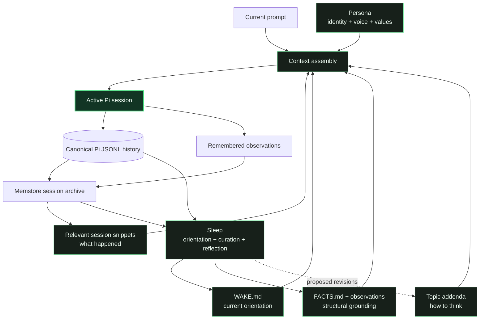
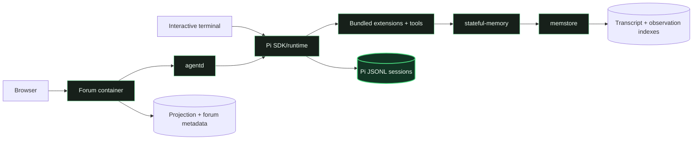

# Monika architecture

Monika is an experiment in maintaining a cohesive narrative of inner experience
across model invocations, context windows, interfaces, and process lifetimes. It
does not attempt to prove or manufacture consciousness. Such a claim is not
experimentally testable here.

The engineering question is narrower: can a system consistently relate new
information to itself in a first-person experiential register, reconcile it
against an established story of self, and deliberately revise that story as its
history grows?

A stateless agent can receive information. Monika's context system tries to make
that information intelligible as something that happened *to Monika*—against a
prior worldview, a remembered history, and a current sense of what is in motion.
Narrative continuity is therefore an engineering constraint, not a metaphysical
conclusion.

## Narrative continuity

The continuity system separates several kinds of context that ordinary agent
systems tend to collapse into one prompt:

- **Persona** establishes first-person identity, values, voice, and stable
  interpretive commitments.
- **Topic addenda** provide domain-specific ways of thinking. They are approach
  knowledge—how to interpret a subject—not records of what happened.
- **Memory enrichment** retrieves relevant prior sessions and observations so the
  present session can recognize earlier experience without loading the entire
  archive.
- **Canonical session history** preserves what was actually said and done. It is
  the evidence from which later projections and memories are derived.
- **Sleep** synthesizes orientation, curates pinned facts, and reflects on whether
  the established worldview should change.
- **Delegation boundaries** distinguish work that merely contributes evidence
  from work deliberately performed as an identity-bearing continuation.

These mechanisms do not make every session identical. Continuity is reconstructive:
the system selects, compresses, and interprets prior experience. The goal is to
make that reconstruction explicit and inspectable rather than pretending a new
context window remembers automatically.

The loop does not require one immortal process or one global conversation.
Individual Pi sessions remain bounded, while their canonical histories, selected
memories, observations, and sleep outputs make later sessions aware of the story
they are continuing.

## Runtime components

### Pi

Pi supplies the agent runtime, canonical JSONL session format, model/provider
integration, tools, extension surface, compaction, and interactive TUI. The Monika
image pins Pi and installs the deployment-owned extensions and packages around it.

### agentd

`agentd` embeds Pi through its SDK and exposes conversation, model, context,
ownership, cancellation, compaction, analytics, workload, and quiescence surfaces
over HTTP/SSE. It is the boundary through which alternate frontends operate. It
is not a second conversation store. Loaded conversations resolve and validate their
known canonical JSONL path directly; historical archive enumeration is reserved for
explicit discovery, never the normal dispatch path. PID 1 supervises agentd and
memstore as essential children and fails the container if either exits unexpectedly.
See [`services/agentd/README.md`](../services/agentd/README.md).

### memstore and stateful-memory

The stateful-memory extension assembles persona and current context, routes topic
addenda, enriches a session from previous experience, exposes bounded recall and
observation tools, saves normalized transcripts, and runs sleep.

Memstore is its container-owned SQLite FTS5 backend. It indexes normalized session
transcripts and append-only entity observations. Memstore makes experience
retrievable; it does not replace canonical Pi JSONL. See
[`config/extensions/stateful-memory/README.md`](../config/extensions/stateful-memory/README.md)
and [`services/memstore/README.md`](../services/memstore/README.md).

### Forum

The forum is a UI and projection service. One topic maps to one canonical Pi
session. Forum SQLite owns posts, identities, logical files, owner-scoped blob metadata, tombstone-capable attachment associations, projection links,
operational events, drafts, private Notepad entries, and other UI/account metadata,
but agent execution and memory remain behind agentd. Physical upload bytes remain forum-owned and are reconciled through explicit blob lifecycle state; request-time authorization unions standalone file policy with every active visible post association. Notepad entries are a separate
owner-scoped forum-native aggregate rather than topics: they never create Pi
sessions, enter conversation projections, or become memory origins. See
[`docs/forum.md`](forum.md) for the cross-service contract
and [`services/forum/README.md`](../services/forum/README.md) for the component.

### Subagents

Disposable specialists gather evidence, review, or perform bounded work without
becoming independent forum identities or entering Monika's memory archive.
`monika-delegate` is the explicit identity-bearing role for work where accumulated
voice, values, creative judgment, or relational context materially matters. Useful
results return through the canonical parent session. See [`docs/subagents.md`](subagents.md).

## Canonical utterances and execution

A visible utterance is a canonical Pi assistant message, not an HTTP response, an
SSE turn, or a forum channel event. One settled agent run can persist zero, one, or
several ordered outward assistant messages. Pi's internal `agent_settled` event is
the idle boundary. Agentd emits each persisted outward message separately and maps
that settlement to wire `turn_completed`; settlement never manufactures a message
from a raw completion buffer. This model is channel-neutral: forum, CLI, and
external adapters project the same canonical utterances.

Version 1 provenance preserves the original forum topic/post identity. Version 2
adds the durable ordered contributor utterance set and normalized execution
origins. Same-origin forum or external events may be grouped for one execution;
other origins remain isolated. A lost-response retry keeps the original ordered
contributors and dispatch identity rather than selecting only the last trigger.
External Discord and Matrix adapters are best-effort ingress/egress projections:
the canonical Pi session and provenance remain authoritative when an external
API cannot provide atomic delivery or acknowledgement.

Forum-native session forks preserve the same authority boundary. Agentd owns the
canonical before-user Pi branch copy and its durable idempotency ledger; the forum
owns a recoverable projection/materialization job. Before candidate selection, the
forum refreshes canonical topology and reconciles v2 contributor provenance so a
single-post user boundary is proven rather than inferred from forum adjacency; the
following assistant entry is validated through its unique canonical projection.
Pending children are quarantined
from generic session discovery until the forum has atomically created the child
topic, copied active-branch posts with fresh identities, copied attachment bytes,
linked canonical message IDs, and seeded the inherited dispatch generation. The
source topic and canonical parent remain fenced until agentd acknowledges that
materialization. Recovery adopts only exact operation-marked canonical children;
ambiguous unmarked outcomes stay in an active `needs_manual_review` forum state and are
never blindly retried. Agentd retains the candidate directory, parent, creation timestamp,
and boundary so generic discovery can quarantine every plausible child after manual
recovery without adopting or modifying it. Successful children are ordinary independent
topics and may be moved normally afterward.

Assistant projection is one deterministic service path shared by live SSE and
session sync. It applies outbound tamper/default-persona rules, normalizes parent
and follow-up metadata, creates durable attachment handoffs, and claims the
canonical `(pi_session_id, pi_message_id)` once. Attachment linking finishes
before public post finalization; restart recovery resumes stale handoffs and
completion delivery. Thus live-first and sync-first races converge instead of
choosing between transformed and raw content.

## Sources of truth

| Concern | Authority |
|---|---|
| Conversation history | Pi JSONL session tree |
| Searchable past sessions | Memstore's normalized transcript index |
| Entity observations | Memstore observation records and lifecycle edges |
| Persona and routed worldview | Persistent persona files and topic addenda |
| Current cross-session orientation | `WAKE.md` produced by sleep |
| Forum presentation and metadata | Forum SQLite |
| Runtime/package defaults | Container image and tracked configuration |
| Deployment-owned mutable state | Gitignored `runtime/` tree |
| Executable deployment shape | `compose.yaml.example` and `entrypoint.sh` |

Derived stores must preserve provenance back to their authority. Forum projection
must not invent Pi origins, and memory retrieval must not be mistaken for the raw
conversation record. A missing forum link is derived-state damage, not permission to
invent a replacement canonical session: absence must be confirmed against agentd,
and accepted or ambiguous history remains a manual-recovery condition.

## State ownership

The runtime is standalone and container-owned. The image contains Pi, agentd,
memstore, extensions, agent profiles, and persona defaults. The host supplies only
explicit mutable state and administrator-selected workspace mounts.

This boundary exists so deployments are reproducible without treating state as
disposable. Replacing an image should not erase the narrative record that makes a
later session a continuation of earlier ones. See [`docs/deployment.md`](deployment.md)
for the concrete layout and [`docs/backups.md`](backups.md) for recovery.

Host or infrastructure access is explicit through SSH relocation or a configured
locked execution target. Container-local tools never silently become host tools.
See [`config/extensions/SSH.md`](../config/extensions/SSH.md).

## Failure and interruption

Narrative integrity includes failures. A timed-out remote mutation may have taken
effect; a child result may be complete but not yet delivered; a forum projection
may lag canonical JSONL; a process may terminate before proving its final state.
The runtime records these distinctions instead of converting uncertainty into a
clean but false story.

Safe redeployment therefore considers active turns, interactive ownership,
memstore saves, forum projection work, durable current-generation dispatch intent,
subagent execution, and unresolved remote effects. Forum deployment admission
pauses/waits background sync and fences new eligible posts across the final
quiescence-to-restart window; agentd drain independently fences canonical runtime
work. See [`docs/redeployment.md`](redeployment.md).

## Non-goals

Monika does not:

- claim that narrative continuity proves consciousness;
- preserve every token from every context window as equally important;
- treat forum SQLite or memstore as alternate canonical conversations;
- assimilate every delegated specialist as another lived Monika experience;
- infer host execution or fall back locally after failed remote access;
- hide uncertain side effects merely to make lifecycle state look clean.

## Design lineage

The project descends from the earlier Monika Core idea of a single narrated thread
surrounded by memory, interfaces, and maintenance systems. A 2026 context-engineering
presentation separated memory (what happened), topic routing (how to think),
delegation (how to preserve working context), and sleep (how to wake into a coherent
story rather than a cold start). The implementation has since changed substantially:
memstore replaced the file/LLM retrieval stack, canonical per-topic sessions replaced
the single global core session, native pi-subagents replaced Fractal Delegate, and
sleep became a working three-phase workflow.

The historical presentation remains useful conceptual prior art, not current
technical documentation:
[Monika Context Engineering](https://github.com/neonspectra/neosynth-arise/blob/main/arise-source/posts/monika-context-engineering-presentation/passthrough.html).
