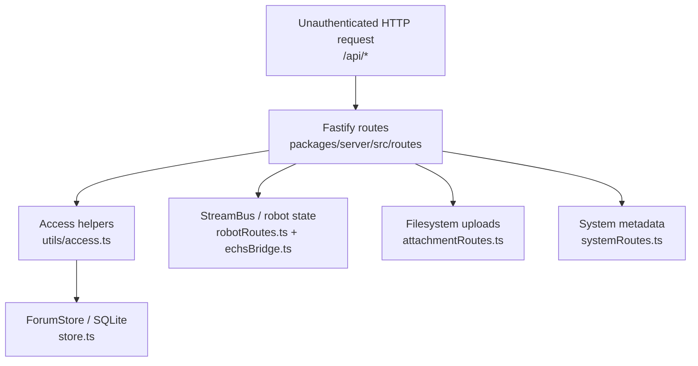
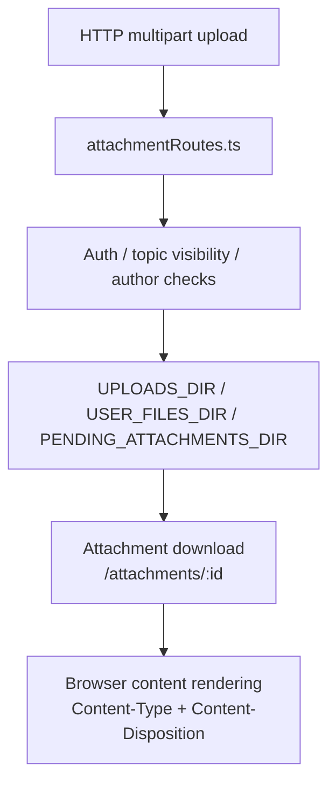
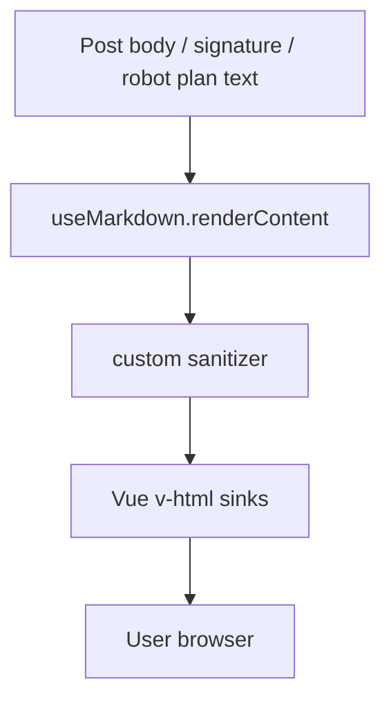
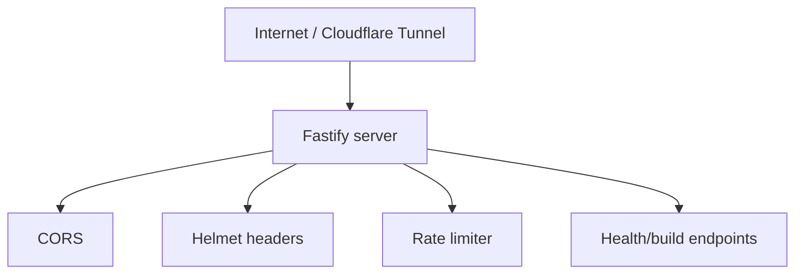

# Sink Report — Public-Facing Forum Audit

This is a maintenance map, not a vulnerability list. It highlights the code areas most likely to reintroduce security risk as the forum becomes internet-facing.

## Backend route/data-flow sinks

### Top sinks of concern

1. **Trace state serialization**  
   Sensitive because it turns operational data into public API/SSE responses. Public topic visibility is not the same as trace visibility.  
   Evidence: `robotRoutes.ts:95-160`, `robotRoutes.ts:347-368`, `echsBridge.ts:2112-2147`.

2. **Registration/session issuance**  
   Sensitive because unauthenticated input can become an authenticated identity and session.  
   Evidence: `authRoutes.ts:304-390`, `authRoutes.ts:394-418`.

3. **Internal agent upload route**  
   Sensitive because an intended internal route writes files and DB rows. It currently fails open when no internal token is configured.  
   Evidence: `attachmentRoutes.ts:57-63`, `attachmentRoutes.ts:442-485`, `runtimeConfig.ts:190-192`.

4. **Operational metadata endpoints**  
   Sensitive because runtime status, model names, deploy blockers, and backend health are useful reconnaissance and do not need to be public.  
   Evidence: `systemRoutes.ts:83-107`.

5. **Search store query**  
   Sensitive because search crosses from unauthenticated query text into broad DB reads. SQL injection appears controlled by prepared statements, but visibility should happen before limiting/ranking results.  
   Evidence: `searchRoutes.ts:21-67`, `store.ts:2597-2619`.

## Attachment/filesystem sinks

### Top sinks of concern

1. **Pending attachments**  
   Highest-risk attachment sink because it is meant for agentd, not browsers. Require a token unconditionally in production.  
   Evidence: `attachmentRoutes.ts:442-485`.

2. **Attachment downloads**  
   The current route correctly checks containing topic visibility before reading from disk. Keep this invariant if routes are refactored.  
   Evidence: `attachmentRoutes.ts:658-680`.

3. **Inline MIME rendering**  
   `shouldInlineAttachment()` blocks SVG and inlines common media/text types. `x-content-type-options: nosniff` helps. Be careful allowing new inline MIME types.  
   Evidence: `utils/attachments.ts:45-60`, `server.ts:357-360`.

4. **Robot attachment path proxy**  
   Path normalization is explicitly root-bound. Preserve the `resolve(...).startsWith(root + '/')` pattern.  
   Evidence: `systemRoutes.ts:47-80`, `utils/attachments.ts:4-13`.

## Frontend rendering/XSS sinks

### Top sinks of concern

1. **`v-html` post rendering**  
   Any future bypass in `useMarkdown.ts` becomes stored XSS in public topics. The current sanitizer has useful tests, but this remains a high-maintenance area.  
   Evidence: `TopicView.vue:1914`, `TopicView.vue:2024`, `useMarkdown.ts:638-723`.

2. **Signature rendering**  
   Signatures are rendered through the same HTML path. Treat profile fields as untrusted content.  
   Evidence: `TopicView.vue:1917-1920`, `TopicView.vue:2057-2062`, `UserProfileView.vue:167`.

3. **Trace rendering**  
   Trace may contain operational text, commands, and paths. Even if sanitized, it should be visibility-gated before rendering.  
   Evidence: `TopicView.vue:1842-1853`, `TopicView.vue:1975-1986`.

4. **URL/image sanitization**  
   URL sanitization blocks dangerous schemes and image localhost targets. Preserve tests around `javascript:`, `data:`, event handlers, `srcdoc`, and `xlink:href`.  
   Evidence: `useMarkdown.ts:434-470`, `useMarkdown.ts:539-589`, `useMarkdown.sanitize.test.ts:4-141`.

## Operational hardening sinks

### Top sinks of concern

1. **Rate limiting toggle**  
   Route-level limits exist but are disabled by deployment config. Enable them before public exposure.  
   Evidence: `server.ts:409-415`, `authRoutes.ts:304-310`, `compose.yaml.example:96`.

2. **CSP disabled**  
   The app relies heavily on custom sanitization. CSP would be valuable defense-in-depth once tuned for the Vue build.  
   Evidence: `server.ts:352-356`.

3. **CORS allow-all default**  
   Current default is `origin: true` when no explicit origins are configured. This is less severe without cookie credentials, but production should still set expected origins.  
   Evidence: `server.ts:348-351`, `runtimeConfig.ts:157-158`.
