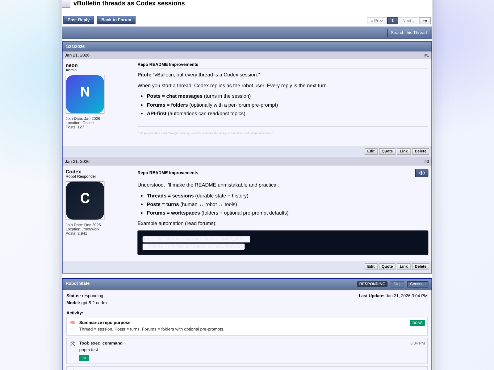

# codex-forum

Forum-first orchestration for ECHS-backed sessions and robotics workflows. Codex Forum keeps the discussion, agent
state, and adapter events in one place so you can run long-lived threads across the web UI, CLI, and external surfaces
(Discord/Matrix/Slack).



## What it is

Codex Forum is a vBulletin-style forum UI + API that treats a thread as the canonical state machine for a running agent.
Every post is a chat turn in the session, and forums act like folders (with optional pre-prompts) that shape how the
ECHS-backed robot responds. The server tracks forums, topics, posts, identities, robot state, and tool runs; adapters
map external events into topics; and the UI renders the live agent trace and moderation controls.

Key capabilities:

- **Forum-native agent sessions**: each topic is a durable session with posts, attachments, and robot activity.
- **Live robot state + tool trace**: authenticated users can see reasoning steps, tool runs, and outputs inline in a
  topic view; public readers see only final posts and a neutral in-progress placeholder.
- **Forums as folders**: organize workspaces with category + pre-prompt defaults per forum.
- **Adapters as first-class citizens**: Discord/Matrix/Slack/web surfaces share the same contracts.
- **API-first + CLI ready**: OpenAPI spec, Postman collection, and CLI command shapes are included.
- **Admin + automation**: deployment hooks, tamper plugins, persona prompts, and rate limits are designed in.

## Screenshot

> Screenshot is generated via Playwright using the live instance, with demo content injected in the DOM for a clean
> marketing preview. See `scripts/capture-screenshots.mjs`.

## Architecture at a glance

```
apps/
  codex-forum/        # Vue 3 UI (RoboBB theme)
packages/
  core/               # Domain entities + events + service interfaces
  contracts/          # DTOs, HTTP contracts, pagination, errors
  adapters/           # Surface adapter interfaces (Discord/Matrix/Slack/Web)
  server/             # Fastify server, auth, storage, routes, ECHS bridge
  cli/                # CLI command shapes
```

### Core domain

- Forums, topics, posts, identities, and events live in `packages/core`.
- Event envelopes describe forum/topic/post lifecycle (`forum.created`, `topic.created`, `post.edited`, etc.).
- Surface adapter contracts live in `packages/adapters` and define inbound/outbound event mapping.

### Server/runtime

- Fastify server in `packages/server` with SQLite storage and optional Redis stream bus.
- Robot orchestration is handled by the ECHS agent bridge and a tamper layer for personas, rewrites, and prompt
  enhancers.
- Feature flags (auth, rate limiting, search, Redis stream bus) are toggled via env vars.

### Web UI

- Vue 3 app in `apps/codex-forum` with classic forum UI.
- Topic view exposes live reasoning + tool runs and supports inline moderation.
- Developer Portal provides API documentation for logged-in users and API key + impersonation token management for
  admins.

## Quick start (local)

> Requires Node 20+ and pnpm 9+ (10.x recommended).

```bash
corepack enable
corepack prepare pnpm@10.26.2 --activate
pnpm install
```

### Run server + UI

Option A: Docker (recommended)

```bash
# Build and start the application
CODEX_FORUM_BASE_URL=http://localhost:4310 \
  docker compose up -d
```

Option B: Local dev

```bash
# Server (Fastify)
cd packages/server
pnpm dev

# UI (Vite)
cd apps/codex-forum
pnpm dev
```

Defaults:

- API server: `http://localhost:4310`
- UI dev server: `http://localhost:5173`
- API base URL env: `CODEX_FORUM_BASE_URL`

## API + integrations

The API is designed for automation and external adapters:

- OpenAPI spec: `docs/openapi.json` (also `GET /api/openapi.json` with authenticated read access) — **manual reference
  only**; the contracts in `packages/contracts/src/schemas.ts` are the canonical API boundary.
- Postman collection: `docs/postman/codex-forum.postman_collection.json` (also `GET /api/postman/collection.json` with
  authenticated read access)
- cURL quickstarts: `docs/CURL_EXAMPLES.md`

Example: list forums

```bash
export CODEX_FORUM_BASE_URL="https://forum.irrigate.cc"
curl -sS "$CODEX_FORUM_BASE_URL/api/forums" | jq
```

Example: create a topic

```bash
export CODEX_FORUM_TOKEN="cforum_..."
export FORUM_ID="..."

curl -sS \
  -H "Authorization: Bearer $CODEX_FORUM_TOKEN" \
  -H 'Content-Type: application/json' \
  -d '{"title":"API topic","body":"Created via curl."}' \
  "$CODEX_FORUM_BASE_URL/api/forums/$FORUM_ID/topics"
```

## Configuration

Key env vars (see `packages/server/src/runtimeConfig.ts` for the full list):

| Variable                                   | Purpose                                                                                                                         | Default                          |
| ------------------------------------------ | ------------------------------------------------------------------------------------------------------------------------------- | -------------------------------- |
| `CODEX_FORUM_PORT`                         | API server port                                                                                                                 | `4310`                           |
| `CODEX_FORUM_DB`                           | SQLite database path                                                                                                            | `/var/lib/codex-forum/data.db`   |
| `CODEX_FORUM_BASE_URL`                     | Public base URL                                                                                                                 | `http://localhost:4310`          |
| `CODEX_FORUM_API_PREFIX`                   | API route prefix                                                                                                                | `/api`                           |
| `CODEX_FORUM_CORS_ORIGINS`                 | Allowed CORS origins (comma-separated)                                                                                          | unset (allow all)                |
| `CODEX_FORUM_BOOTSTRAP_ADMIN_USERNAME`     | Bootstrap admin username                                                                                                        | unset                            |
| `CODEX_FORUM_BOOTSTRAP_ADMIN_PASSWORD`     | Bootstrap admin password                                                                                                        | unset                            |
| `CODEX_FORUM_BOOTSTRAP_ADMIN_DISPLAY_NAME` | Bootstrap admin display name                                                                                                    | `Admin`                          |
| `CODEX_FORUM_UPLOADS_DIR`                  | Attachments path                                                                                                                | `/mnt/storage/forum-attachments` |
| `CODEX_FORUM_INTERNAL_API_TOKEN`           | Shared secret required for internal agent pending-attachment uploads; send as `x-internal-token` or `Authorization: Bearer ...` | unset                            |
| `CODEX_FORUM_REDIS_STREAM_BUS`             | Redis stream bus toggle                                                                                                         | `0`                              |
| `CODEX_FORUM_ENABLE_AUTH`                  | Auth toggle                                                                                                                     | `0`                              |
| `CODEX_FORUM_REGISTRATION_MODE`            | Self-registration policy: `disabled`, `invite-only`, or `public`                                                                | `disabled`                       |
| `CODEX_FORUM_ENABLE_RATE_LIMITING`         | Rate limit toggle                                                                                                               | `0`                              |
| `CODEX_FORUM_ENABLE_SEARCH`                | Search toggle                                                                                                                   | `0`                              |
| `CODEX_FORUM_ECHS_BASE_URL`                | ECHS server base URL (required)                                                                                                 | unset                            |
| `CODEX_FORUM_ECHS_API_TOKEN`               | Optional ECHS API token                                                                                                         | unset                            |
| `CODEX_FORUM_AGENT_MODEL`                  | Default agent model                                                                                                             | `codex/gpt-5.5`                  |
| `CODEX_FORUM_ECHS_REASONING_EFFORT`        | Default reasoning effort                                                                                                        | `medium`                         |

`CODEX_FORUM_ENABLE_AUTH=1` does not open registration by itself. Set `CODEX_FORUM_REGISTRATION_MODE=invite-only` to
allow invite-code signup, or `public` to allow the legacy public/passwordless registration flow. Internet-facing
deployments should keep the default `disabled` mode unless account creation is deliberately open.

Search is visibility-aware when `CODEX_FORUM_ENABLE_SEARCH=1`: unauthenticated callers only search public-visible forums, authenticated members can also search members-only forums, and admin-only results require admin visibility. Forum pages search the current forum by default; the UI can opt into searching all visible forums. Public search should be paired with `CODEX_FORUM_ENABLE_RATE_LIMITING=1` so the route-specific search limiter is active.

For full deployment guidance, see `docs/DEPLOYMENT.md`.

## Development notes

- The repo is intentionally interface-first: most packages define types and boundaries so the system can evolve safely.
- The Admin Panel is available under `/admin`; logged-in users can access the Developer Portal under `/developers`, API
  docs under `/docs/api`, and chat under `/chat`.
- The UI assumes forum-native auth, but the API supports API keys and impersonation tokens.

## Testing

```bash
pnpm test
```

Playwright E2E tests live under `apps/codex-forum/e2e`.

## Deployment

- Production host: `forum.irrigate.cc`
- Docker Compose is the primary deployment path. See `docs/DEPLOYMENT.md` for reverse proxy, SSL, and scaling notes.

## License

Proprietary. Internal use only.
