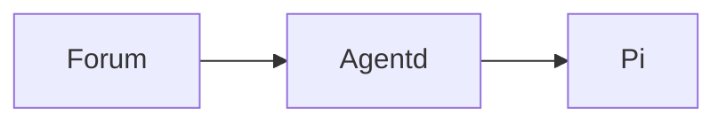

# Mermaid diagrams

Forum posts support Mermaid diagrams through fenced Markdown blocks whose first info-string token is `mermaid`:

````markdown

````

The Markdown source remains the canonical post content. The browser turns completed fences into diagrams as a
progressive enhancement; an incomplete live-response fence remains literal code until its closing fence arrives. A
failed, unsupported, oversized, or disabled diagram always retains its escaped source.

## Supported diagrams

The forum bundles the full Mermaid package and accepts every built-in diagram grammar supported by the pinned Mermaid
release. It does not use Mermaid Tiny. Optional third-party icon packs, custom renderers, and external diagram plugins
are not loaded automatically.

Normal diagram syntax—including directions, labels, sections, and Mermaid accessibility declarations such as `accTitle`
and `accDescr`—is supported. Author-controlled renderer configuration is not:

- YAML configuration front matter is rejected.
- Legacy `%%{init: ...}%%` and other initialization directives are rejected.
- JavaScript callbacks and host-page interaction are unavailable inside the sandbox.

These restrictions do not select or disable individual diagram types. They prevent post content from changing the
forum-owned rendering and security policy.

## Rendering and themes

Mermaid is dynamically imported only when a completed diagram approaches the viewport. Rendering is serialized because
Mermaid configuration is process-global in the browser. The renderer uses Mermaid's `base` theme and derives its palette
from the active forum theme's semantic CSS variables. Mounted diagrams rerender when the resolved website theme changes.

Each rendered section displays at most ten diagrams. Individual source is limited to 20,000 characters and Mermaid is
configured for at most 200 edges. Content exceeding a presentation limit remains saved and readable as escaped source;
the limits govern browser rendering, not post persistence.

Every diagram provides:

- A collapsible source view.
- Copy source.
- Open full size in a new browser tab.
- Download SVG.

The full-size and downloaded SVG are independently sanitized before leaving the display sandbox. PNG export and a custom
fullscreen modal are intentionally not part of the initial implementation; scalable SVG provides lossless export and
browser-native zoom.

## Security boundary

Forum Mermaid source is untrusted stored content. Rendering uses:

- The exact Mermaid version pinned in `apps/codex-forum/package.json`.
- `securityLevel: "sandbox"` with a permissionless iframe.
- `startOnLoad: false`, `htmlLabels: false`, and suppressed Mermaid error graphics.
- Forum-owned secure configuration keys, source/edge/count limits, and serial rendering.
- A validated Mermaid data-document shape before mounting the iframe.
- A separate DOMPurify SVG policy for full-size and downloadable exports.

Do not allow author-provided SVG through the general Markdown sanitizer, weaken the iframe sandbox, enable Mermaid's
loose security mode, or insert Mermaid output directly into the host page. Mermaid security advisories must be reviewed
when upgrading the pinned dependency.

The forum currently enhances persisted post bodies, reply/new-thread previews, and completed fences in live assistant
text. Signatures, profile fields, template previews, and reasoning/trace details remain ordinary escaped code blocks.

## Validation

Changes to this integration should cover:

- Fence boundaries, nested fences, indentation, CRLF input, and incomplete streaming fences.
- Escaping, malformed diagrams, configuration-directive rejection, and size/count limits.
- Multiple and identical diagrams without ID collisions.
- Permissionless sandbox validation and known Mermaid injection payloads.
- Export sanitization.
- Light/dark website theme changes.
- Production build chunking so Mermaid is absent from the initial application chunk.
